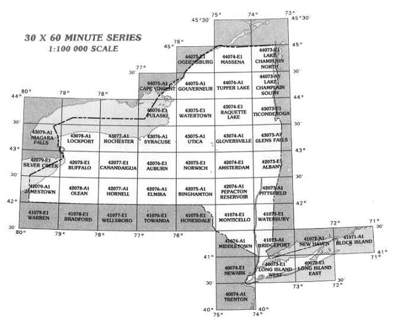
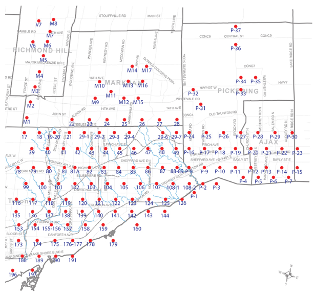
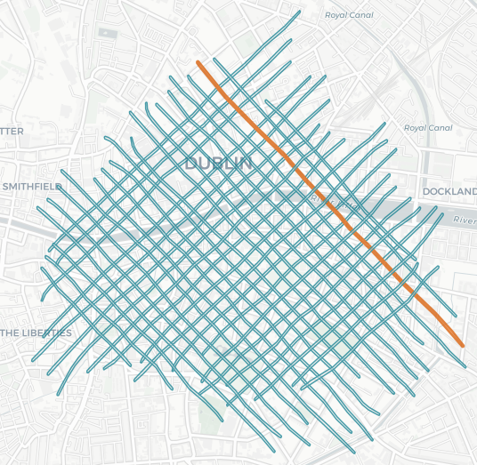

# Creating GeoJSON for OpenIndexMaps
a workshop held at Geo4LibCamp, February 3, 2020, 1:30-4:30pm

# OpenIndexMaps

An index map provides a map-based guide to finding individual maps or datasets in a series based upon their location.  They can be grid-like, with each rectangle representing a separate topographic map in a series, for example.  Or they can be point-based, with each point in the index referring to the approximate center of an aerial photo.  Or they can even be lines, each representing a LiDAR collection flight line.

OpenIndexMaps provides a specification for encoding an index map in the GeoJSON format.  It provides details and access information about each individual mapsheet or sub-dataset, which can be represented either as points, lines, or polygons.  Further work will standardize the information about the collection as a whole.

- [OpenIndexMaps.org](https://openindexmaps.org/) has the basic specification created in 2018
- [github.com/OpenIndexMaps](https://github.com/OpenIndexMaps) has repositories of index maps by institution
- [GIS Index Map Creation Requirements and Recommendations](https://docs.google.com/document/d/1GS1_4JmgUkZcehiG1qEyQB3e6mRQ7jdGC7rpyesZqIw/edit) is a draft document being developed by a group led by Tom Brittnacher (UCSB)

# GeoJSON - what it is and why
- long attribute names, etc.
- History of GeoJSON
- RFC7946 - WGS84 only, 7 digit precision

# QGIS
- review of QGIS features/tools for those new to QGIS
- dealing with CRS
- using selection and identify tools
- styling, transparency
- plugins
- processing toolbox

# Create polygon index map from an existing shapefile
- example: NYS elevation indexes
- QGIS symbology (transparency, outlines only, etc.)
- show labels
- refactor fields to edit columns and names
- export as geojson
- RFC7946, WGTS84
- beware of date-like fields (ogr2ogr has new option, though!)

Create point index map from CSV
- example: NYS aerial photos
- lat/lon to point
- refactor fields
- export as geojson

Create index map from CSV needing some manipulation
- example: nationalmap NED1
- convert bounds from text format to polygons
- QGIS virtual layers, SQL

Create index map from new grid
- Create grid in QGIS
- formula for grid labels
  - label expression like `char(45-bottom+65)||(left+81)`
  - once the formula looks good, calculate new 'label' column using the expression
- edit form for names - can hide columns (layer properties > attributes form > drag and drop designer)

